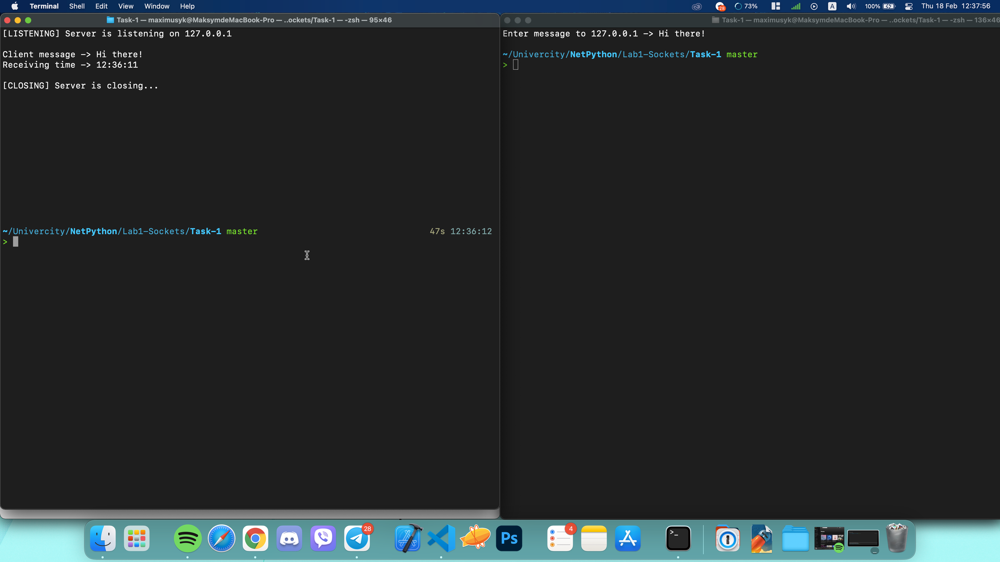
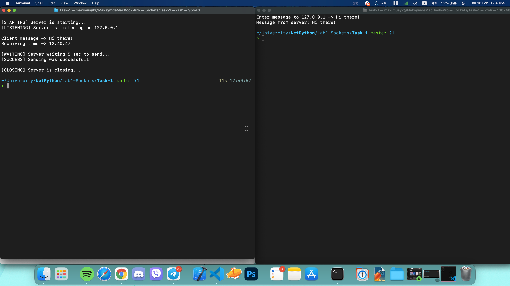
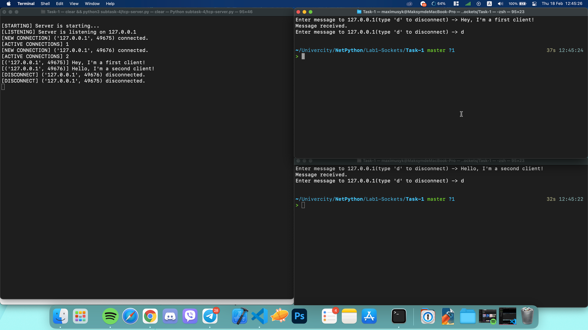
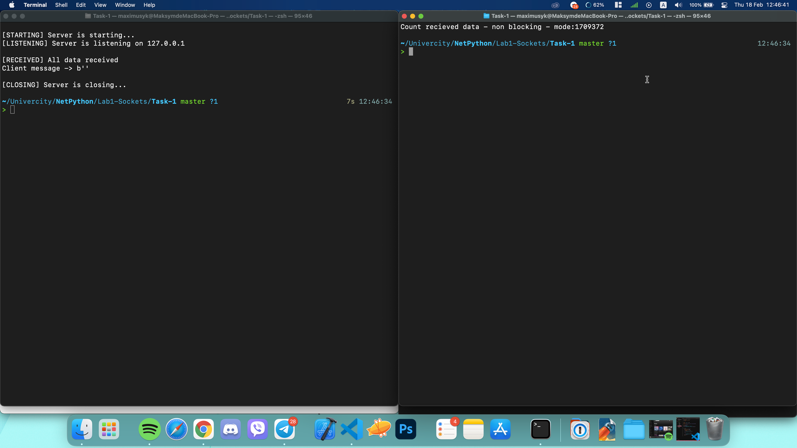
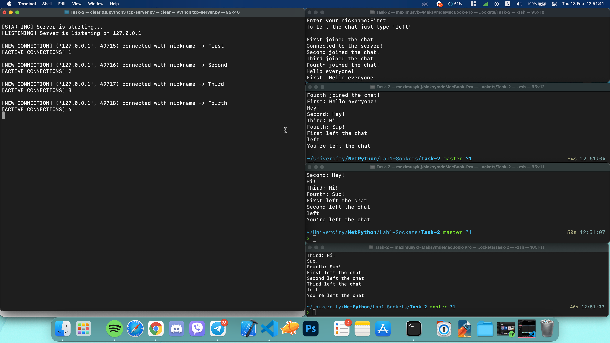

# Lab-1 Sockets

Task-1:

1. Create a basic TCP server and TCP client according to the scheme above. For simplicity, both the client and the server can run on the same PC. The client process requires the user to enter text and then sends it to the server process. The server prints the received sentence and the time of its receipt.
2. Change the code so that the server responds to everything (echoes) what it listens to from the client, with a delay of 5 seconds and verification (use data size) that all data is sent successfully. He continued to disconnect from the client.
3. Change the code so that data can be sent more than once from the client to the server, and the server closes the connection only after receiving a specific command.
4. Test work with two clients.
5. Test the socket in non-blocking mode using the `socket.setblocking` method.

Task-2:

1. Design the simplest multi-threaded chat room.
