# Lab-3 Flask Portfolio

1. Set the virtual environment in the folder surname_project. Install Flask and make initial settings
2. Develop a static portfolio website about you that contains at least 3 pages with navigation. Add your CSS styles (like app / static / css / main.css), connect to Bootstrap and optionally JS. Use some Bootstrap template as a base, html pages to inherit from it with blocks. Page titles should change dynamically according to their content. The code of the template of one of the pages should contain examples of the for loop, the other of the if statement. In the footer of the pages, display information about your operating system (use the os module), user_agent data (use the request module), the Python version and the current time (do not prescribe manually).
3. Test it. Make screenshots and link to the code.

###### Project Structure

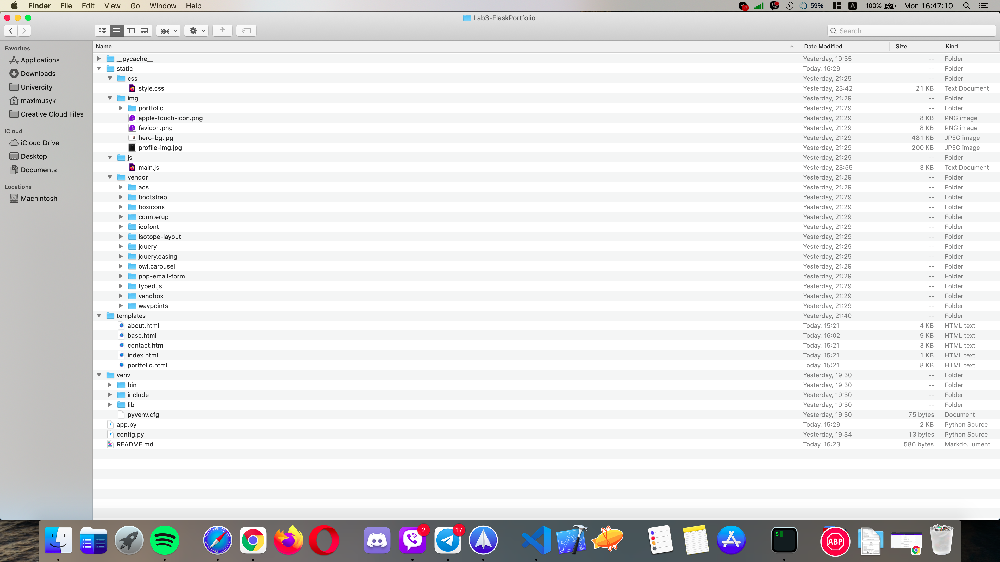

###### Starting the Server

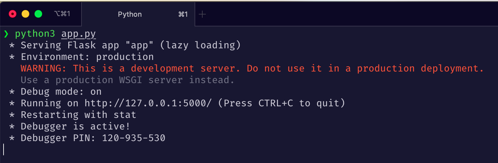

###### Home Page

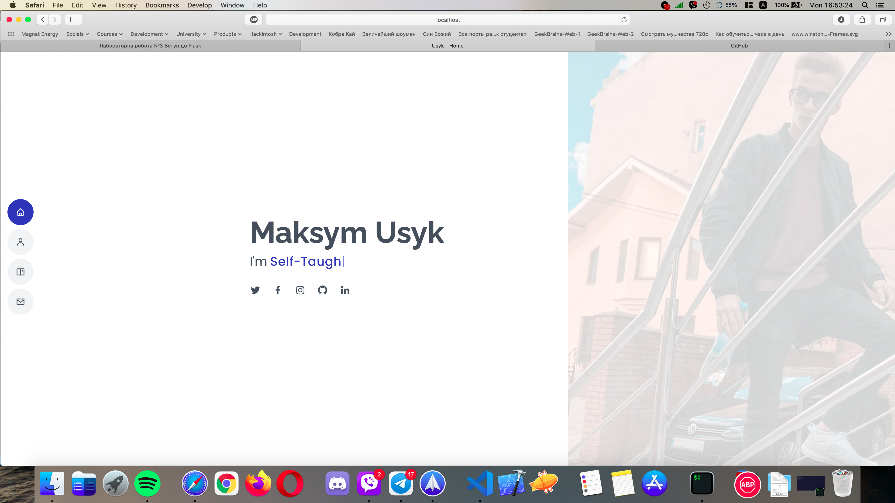

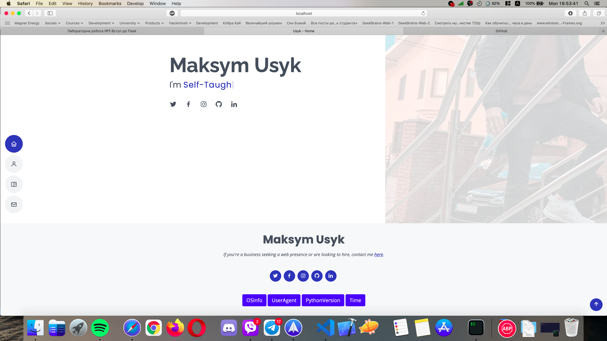

###### About Page

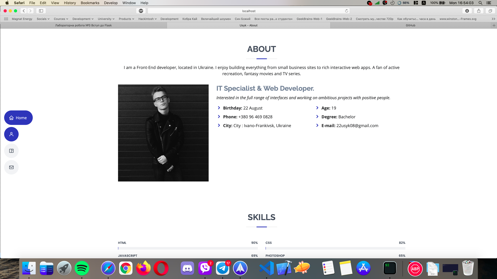

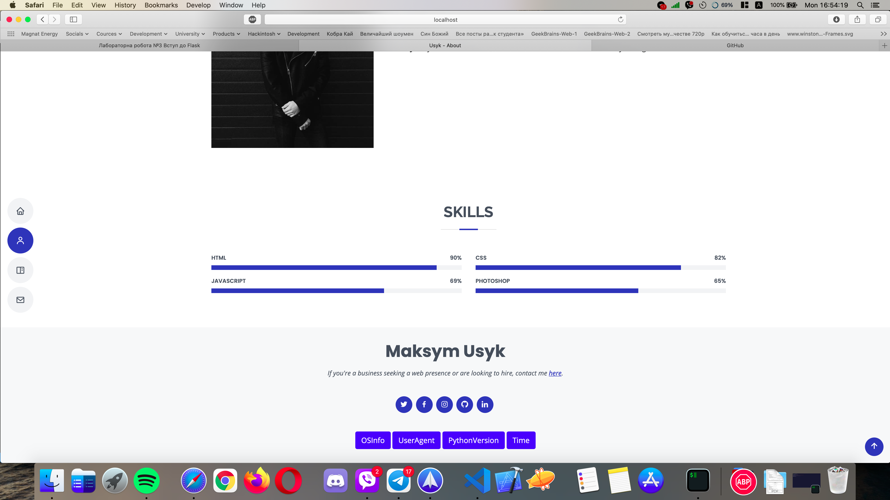

###### Portfolio Page

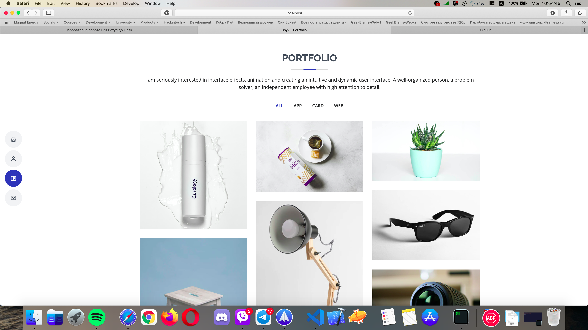

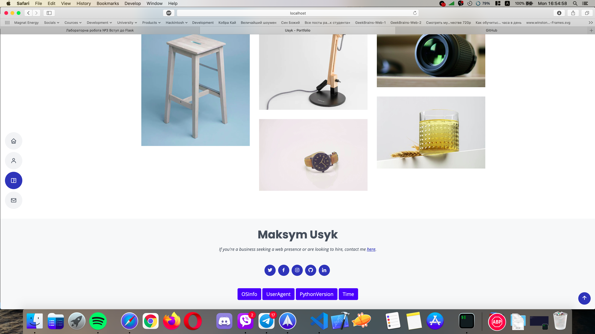

###### Contact Page

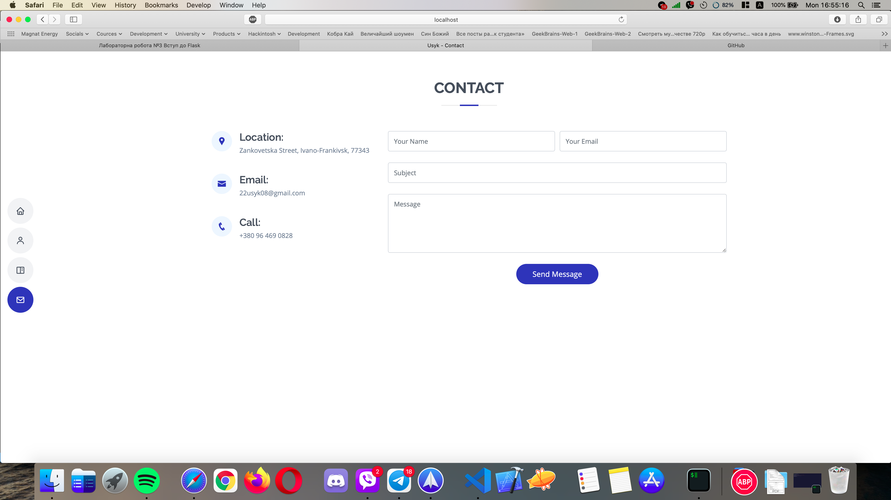

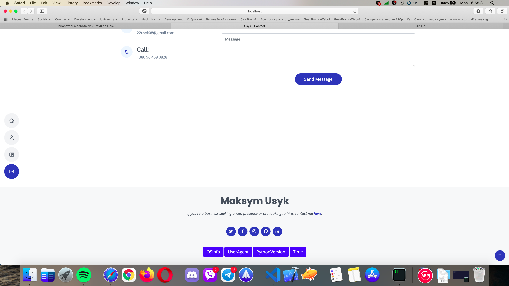

###### OS Info

###### User-Agent Info

###### Python Version

###### Time

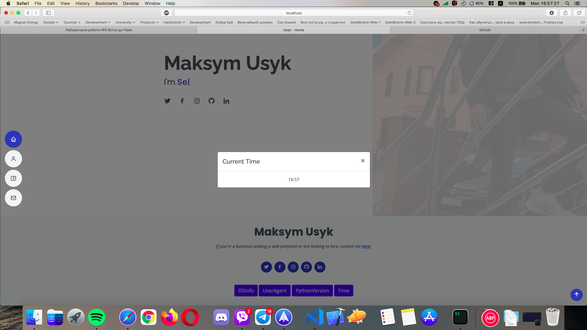

###### Ending the Server

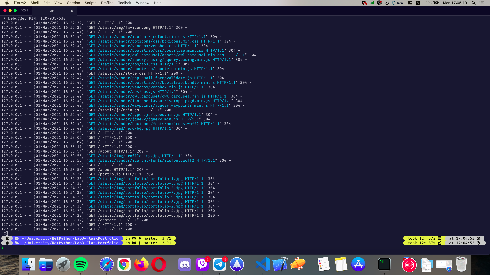
