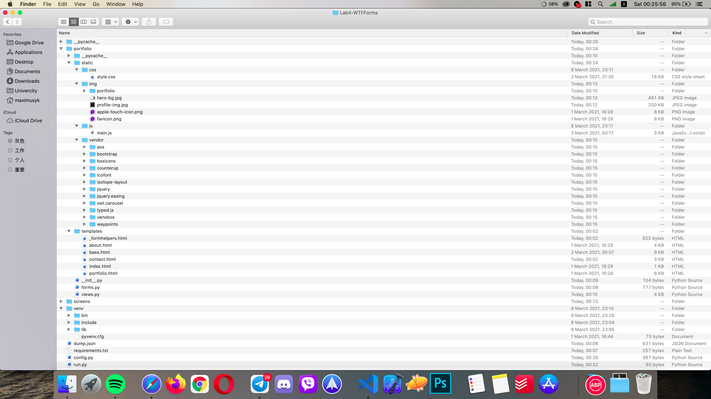
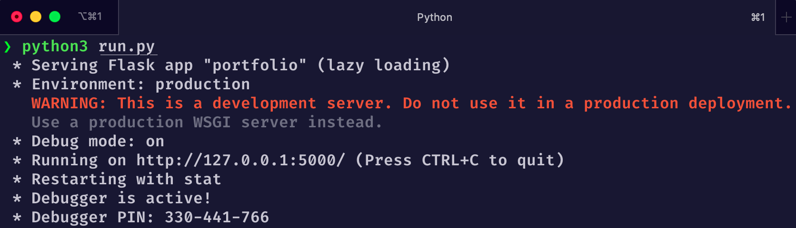
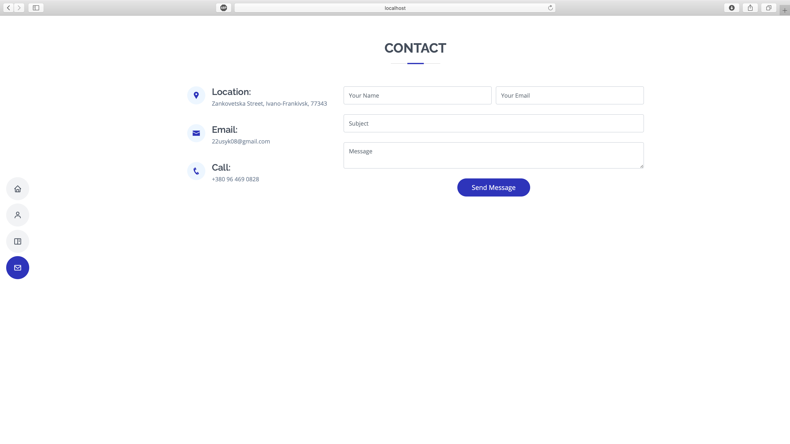
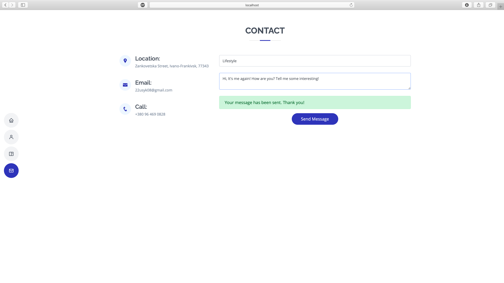

# Lab-4 WTF-Forms

1. Perform refactoring of laboratory code №3 according to the scheme.
2. Add to your site a contact form page with the fields name, email, body (TextAreaField). For a view of this form, see [here](https://cdn.hackersandslackers.com/2021/02/wtforms-no-error.gif).
   Implement this form using wtf-form:
   2.1 Describe the form class with fields in the forms.py file. Ensure proper validation of the fields. When validating, change the standard messages to your own (message argument).
   2.2 In the html-template implement the display of contact form fields using the macro render_field (in the macro set the field styles, display errors with field.errors).
   2.3 In the corresponding view function to ensure the display and processing of the form:
   2.3.1 Successful data retrieval should be displayed via flash messages.
   2.3.2 Data, in the form of {name: 'Petro', email: 'petro@ukr.net', body: 'Hello! My name is Peter. You can .... '} write to an json file each time.
   2.3.3 use the Post / Redirect / Get template so that page overloading does not result in a repeat POST request.
3. If the user has already sent a message and wants to send another message within the session, he should be shown the form ONLY with the text field body, to write the message in the json-file name and email take from the session.

###### Project Structure

###### Starting the Server

###### Contact Page

###### Validation

###### Same Session Demonstration

###### Dumped data to JSON

