# Lab-5 ORM. Modelling with Flask-SQLAlchemy

1. Create model "Task":

|    Task     |                       |
| :---------: | :-------------------: |
|     id      |       int (PK)        |
|    title    |        varchar        |
| description |        varchar        |
|   created   |       timestamp       |
|  priority   | enum(low,medium,high) |
|   is_done   |        boolean        |

Set the created default, priority, is_done fields to the default values,
implement the `__repr__` method in the Task class.

2. Using the command line to initialize the creation of the corresponding table in the SQlite database,
   create some two instances of Task and save them in the database, then get all the records from the database, by making a request.
3. Implement routing and appropriate templates for the Task CRUD model.

| Method | Path                    | Action                |
| ------ | ----------------------- | --------------------- |
| POST   | `/task/create`          | Add a task            |
| GET    | `/task`                 | List all of the tasks |
| GET    | `/task/<int:id>`        | View a task           |
| POST   | `/task/<int:id>/update` | Update a task         |
| POST   | `/task/<int:id>/delete` | Delete a task         |

###### Model Realization

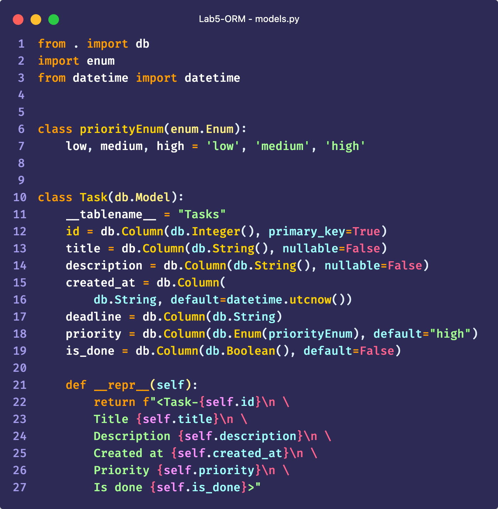

###### Existing routing

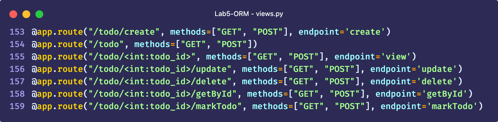

###### Database Contents

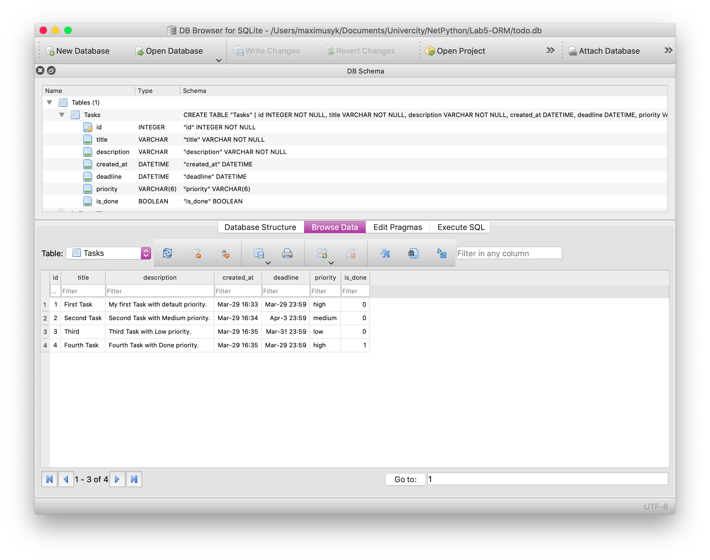

###### Starting the Server

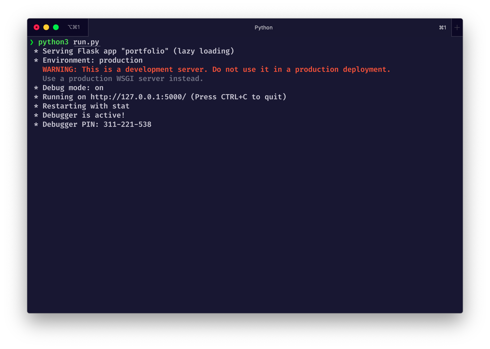

###### Init Screen

###### Adding new Tasks

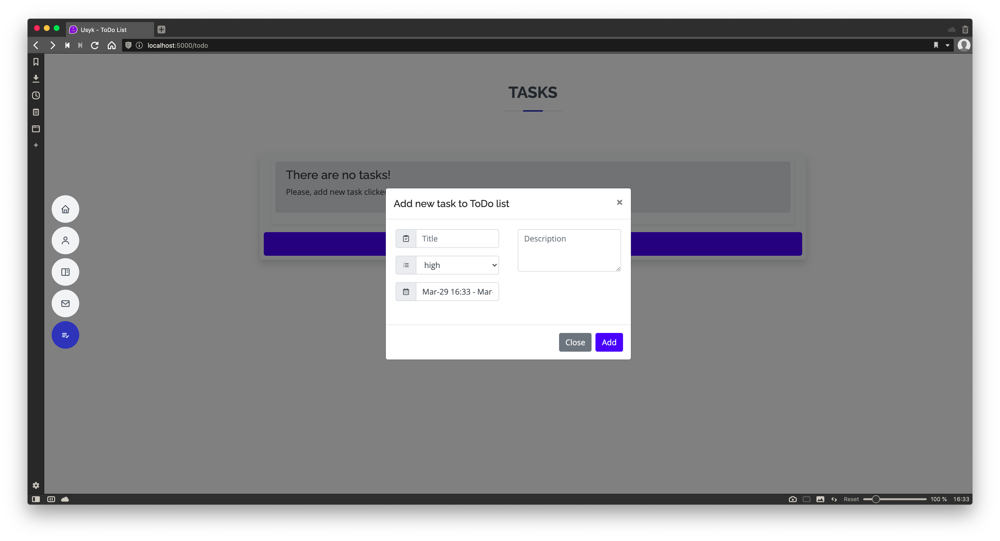

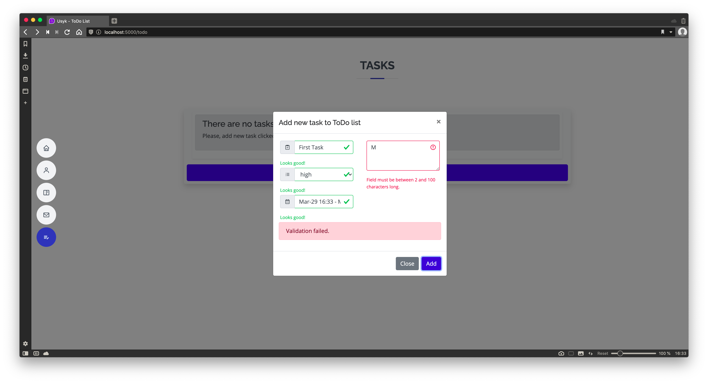

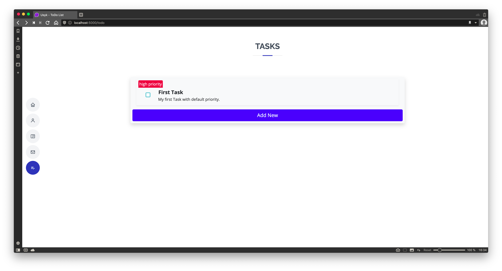

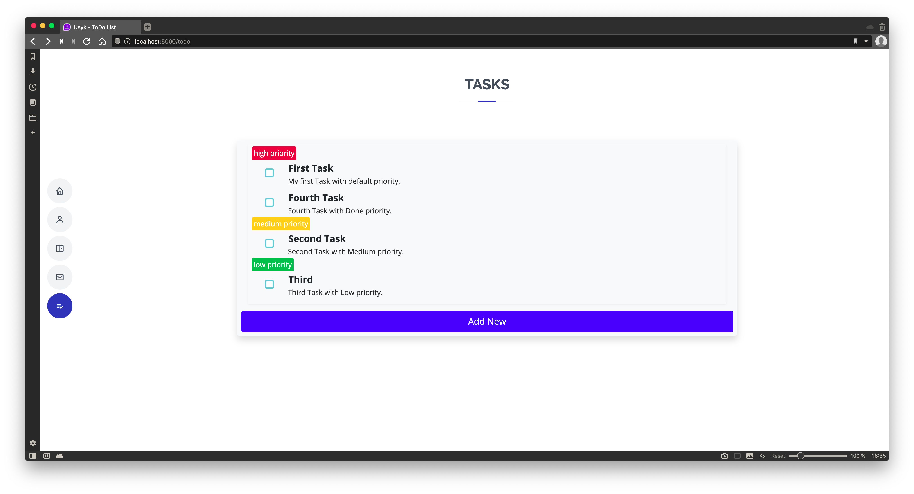

###### Editing Tasks

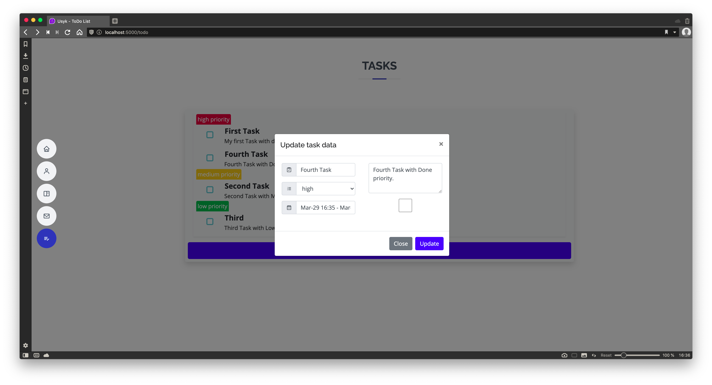

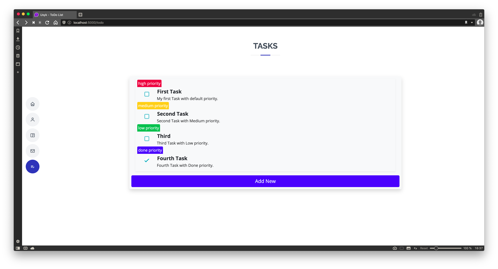

###### Deleting Tasks

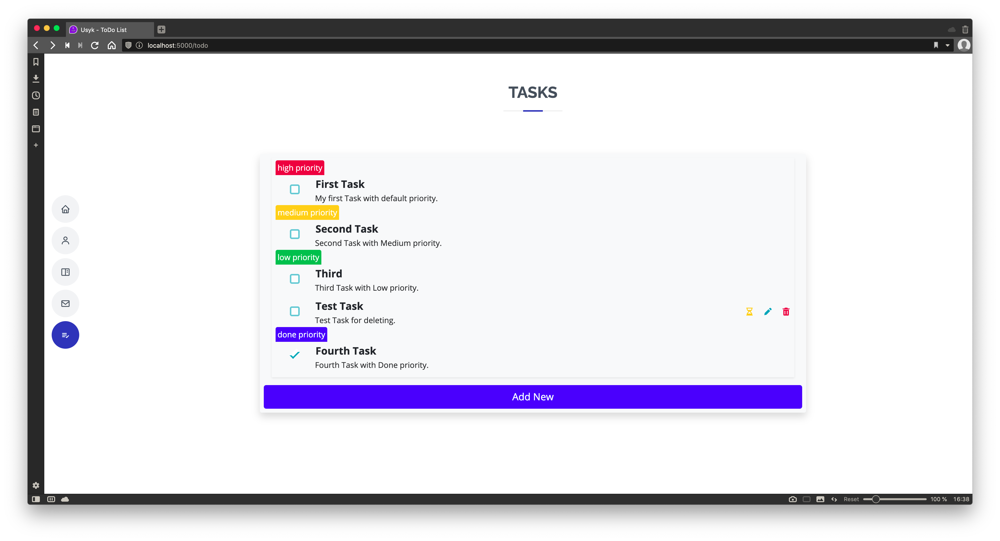

###### View Task Data

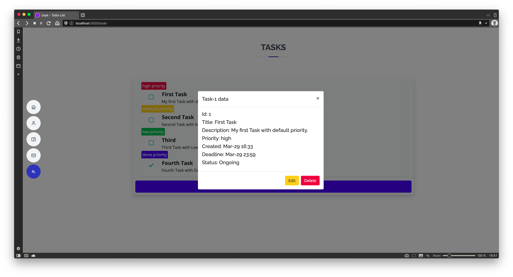

###### View Task Dates

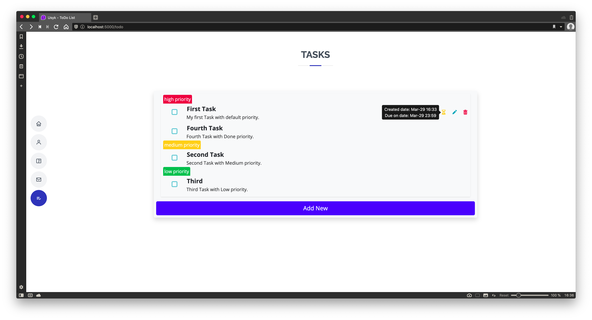
