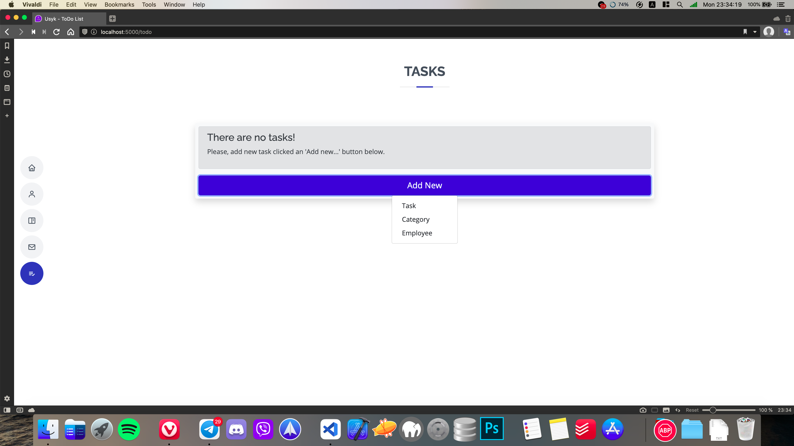
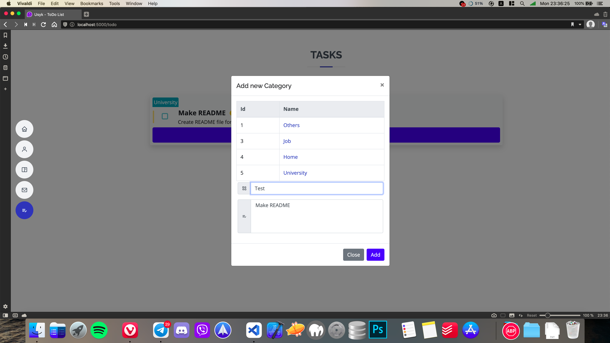
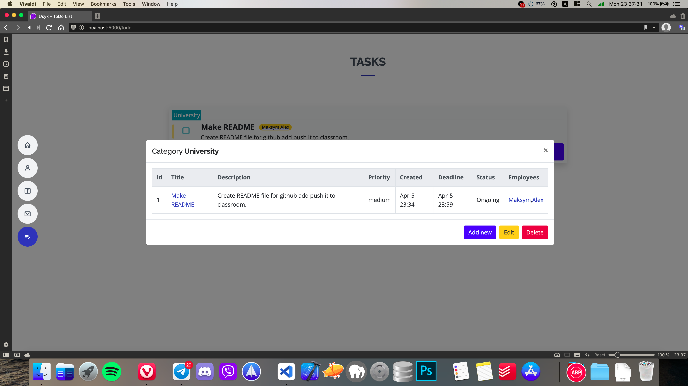
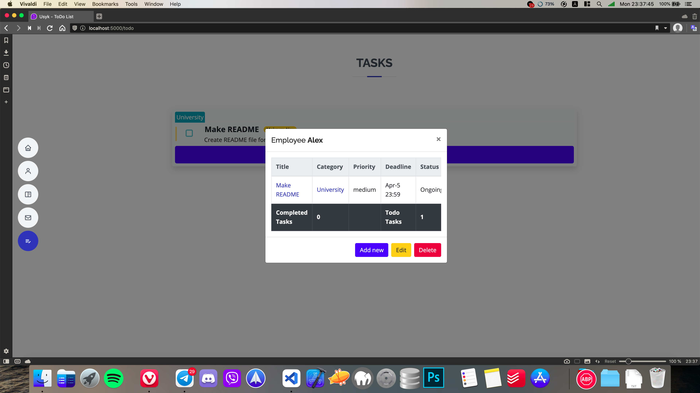
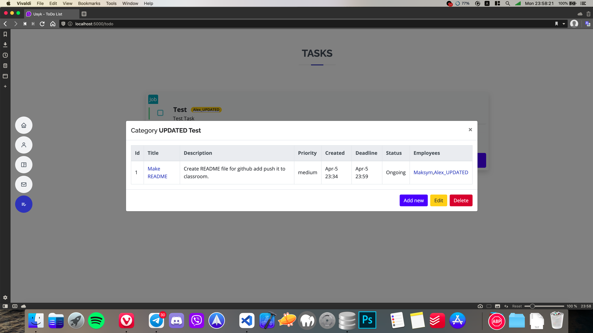
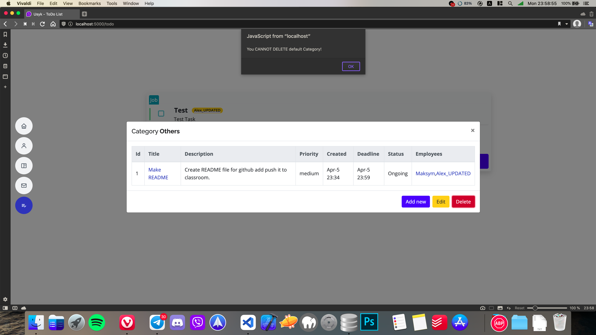
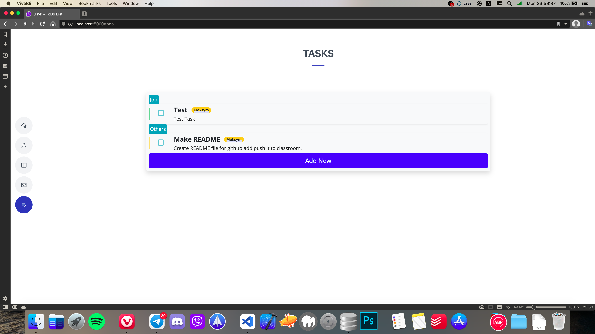

# Lab-6 Migrate

1. Create manage.py [file](###### Delete Category).
2. Add Category model(id,name) associate it with th Task model. An instance of Task model(some task) can belong to no more than one category. Add CRUD feature to Category.
3. Add the Employee model(id, name, count_of_completed_tasks) and link the Task model with "many to many" relationship.
4. List all tasks in descending order of priority and date, adding a category to each of the tasks. Also next to display the employees of each task. When you click on an employee, his profile should be displayed(all his tasks, the number of completed and uncompleted tasks).

###### Add new button

###### Add new Task

###### Add new Category

###### Add new Employee

###### Read Category

###### Read Employee

###### Update Category

###### Update Employee

###### Delete Category

###### Delete Default Category ("Others")

###### Delete Employee

###### Delete Default Employee ("Maksym")

