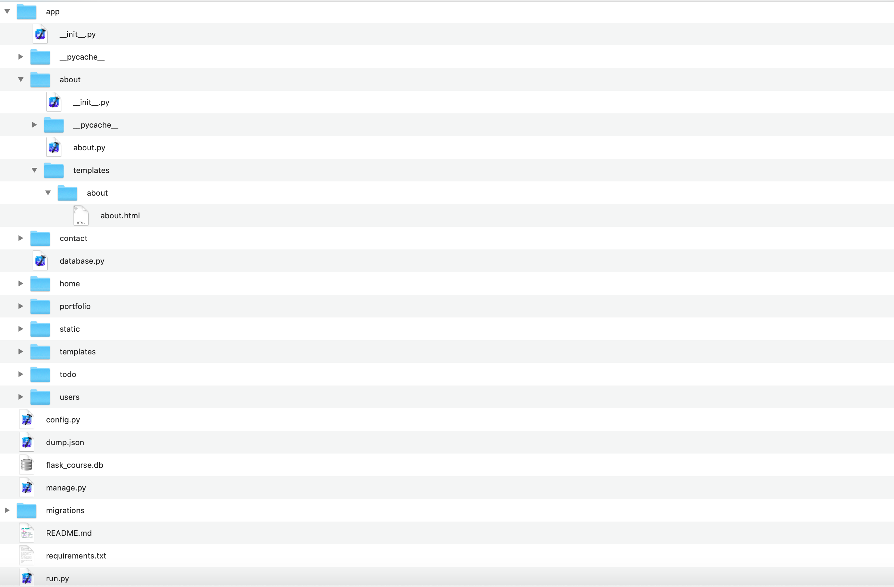
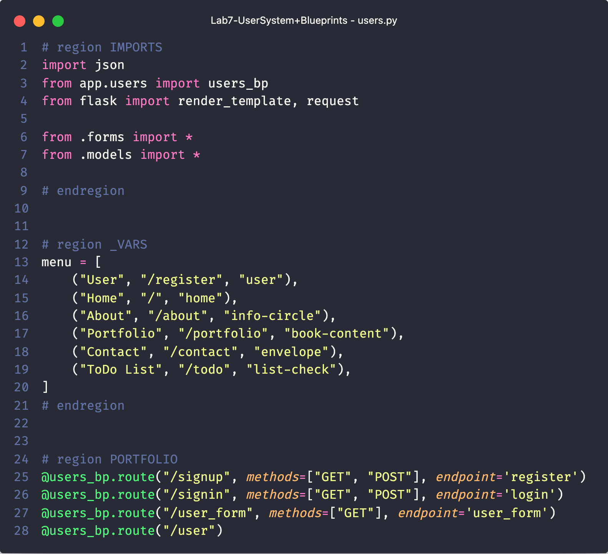
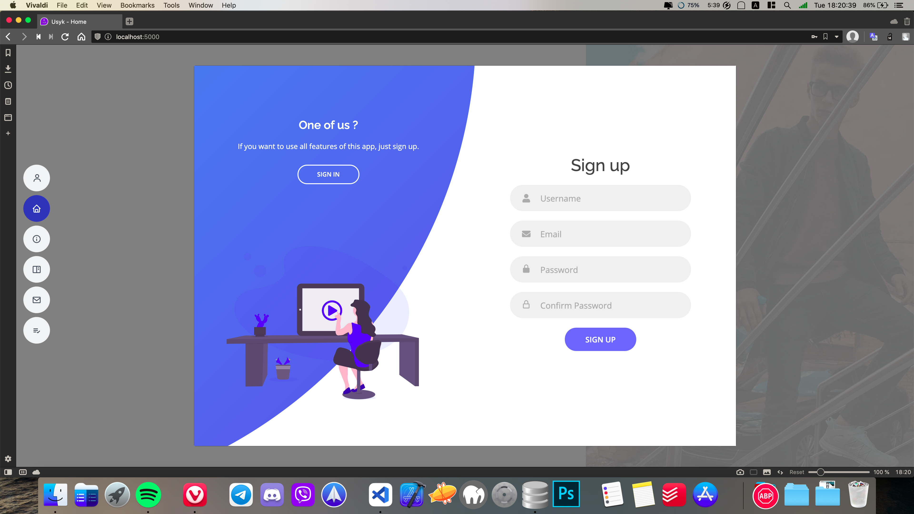
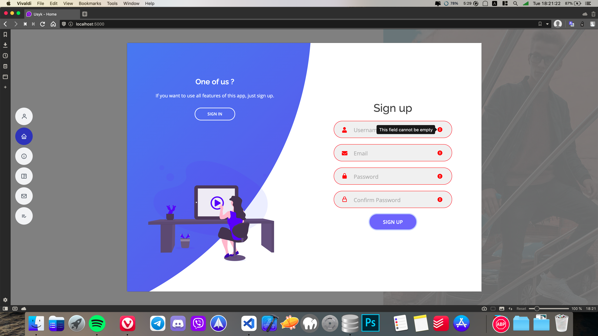
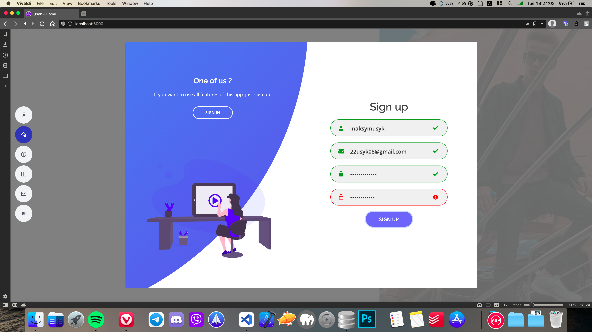
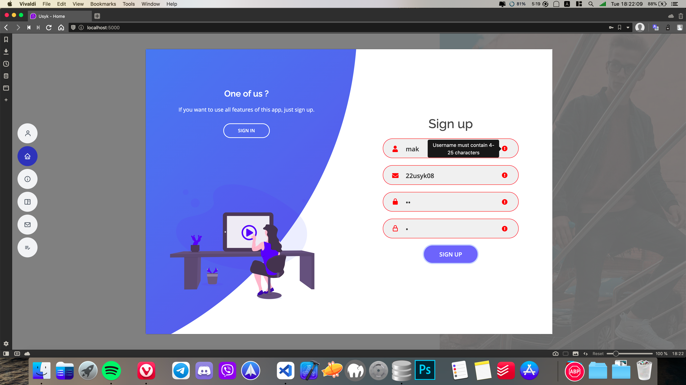
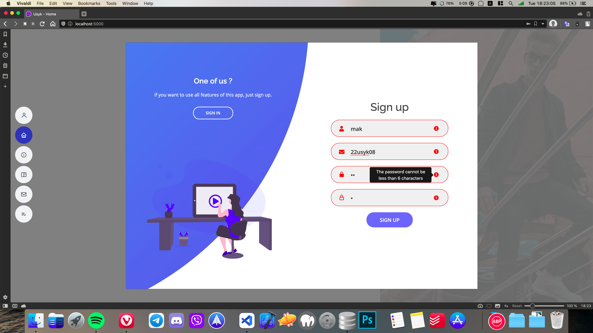
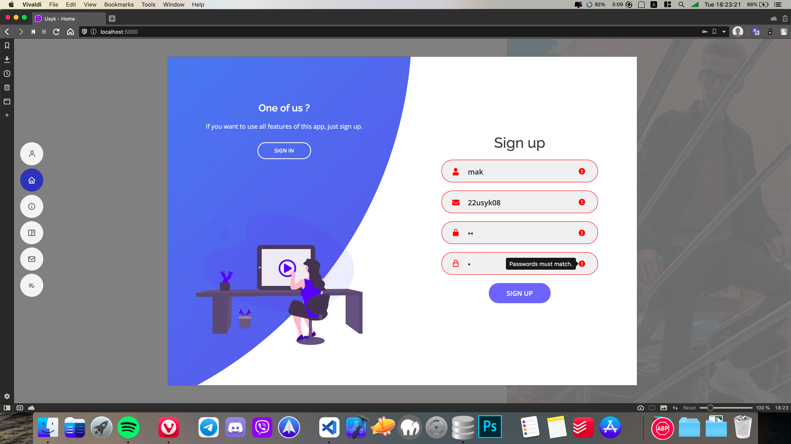
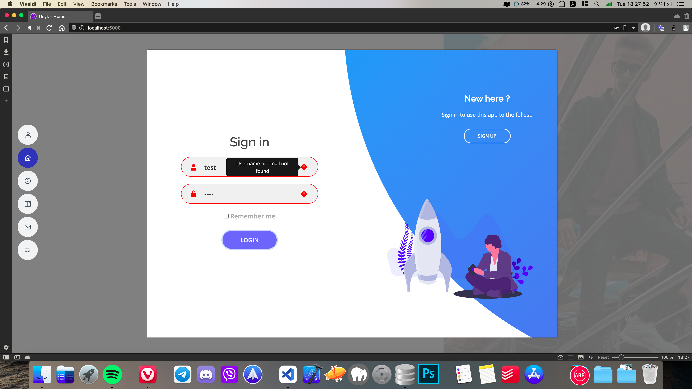

# Lab-7 UserSystem+Blueprints

1. Refactor project to work with Blueprints.
2. Add Registration and Login forms and models.
3. Make routes to work with forms and models.
4. Validate forms(Registration: check if user exist, email, password match; Login: check if user exist, password match with db).

###### Project Structure



###### Example of `__init__.py` file with Blueprint

```__init__.py
from flask import Blueprint


users_bp = Blueprint('users_bp', __name__, template_folder="templates/users")

```

###### Example of view file with Blueprint



###### Sign up form



###### Sign up form validation overlook













###### Sign in form


###### Sign up form validation overlook





