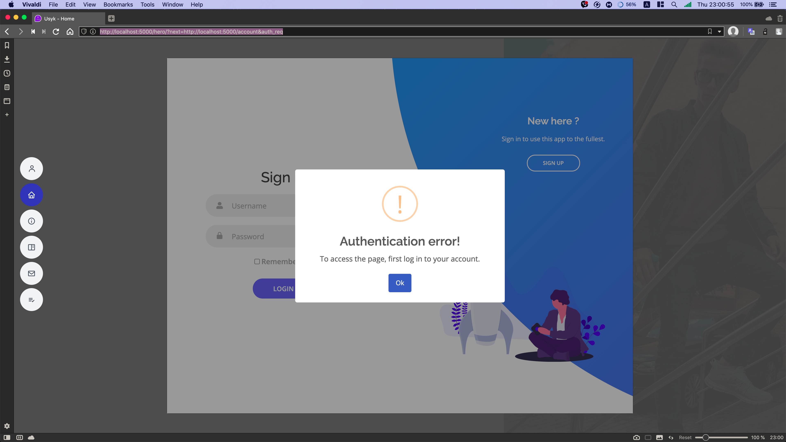

# Lab-8 FlaskLogin

1. Refactor code to work with Flask-Login.
2. Add user auth checker to routes(sign in/up, account, logout).
3. Add @login_required decorator for 'account', 'logout' routes.

###### Redirect to home page and show user sign in/up modal form



###### Implementation custom `@login_required` decorator.

It was help me to open user form dynamicaly, without user interaction.

```python
# Decorator implementation
def auth_required(f):
    @wraps(f)
    def decorated_function(*args, **kwargs):
        if not current_user.is_authenticated:
            return redirect(url_for('home_bp.index', next=request.url) + '&auth_req')
        return f(*args, **kwargs)
    return decorated_function

...

# Examples of use
@users_bp.route("/logout", methods=["GET"])
@auth_required
def logout():
    logout_user()
    return redirect(url_for('home_bp.index'))

...

@users_bp.route("/account", methods=["GET"])
@auth_required
def account():
    return render_template("account.html", menu=menu)
...
```
